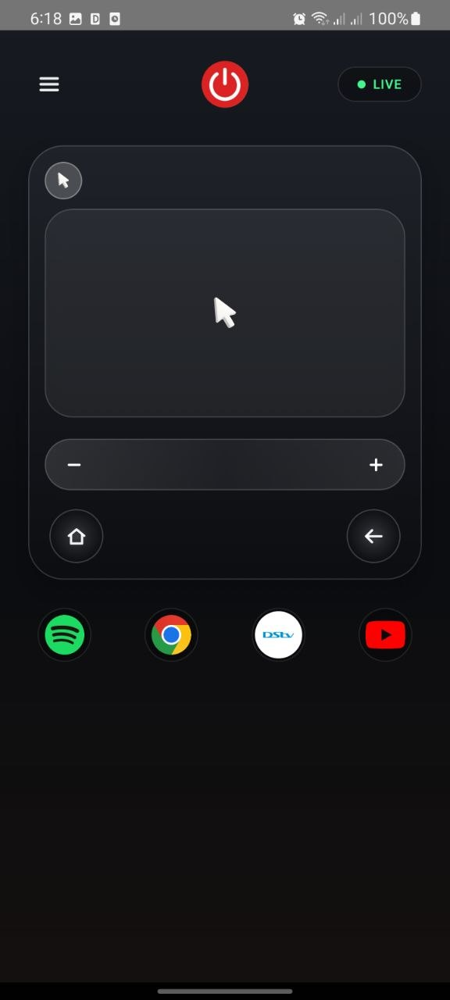
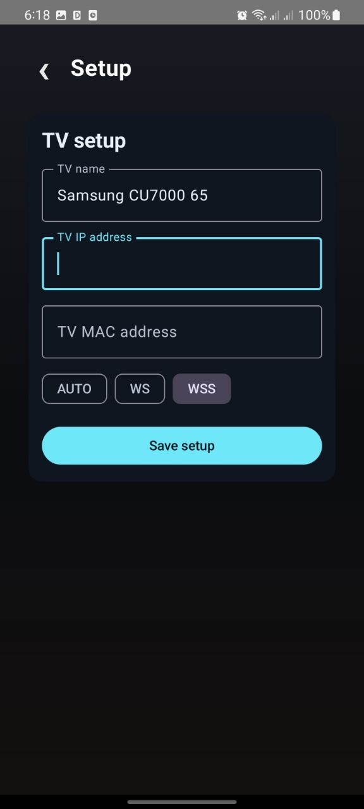
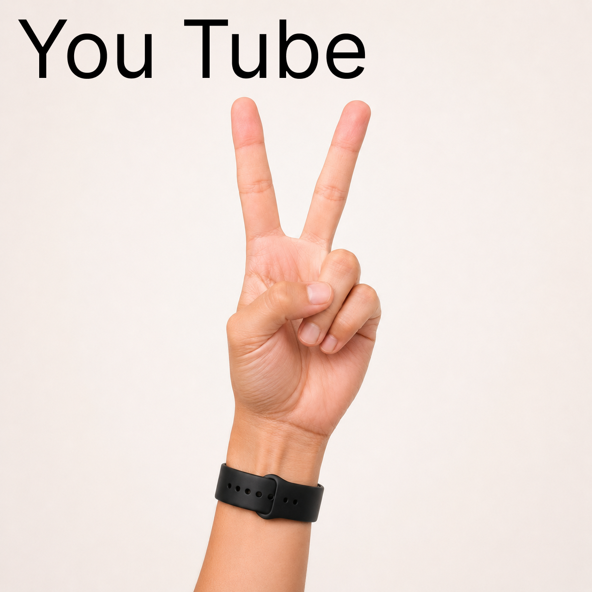
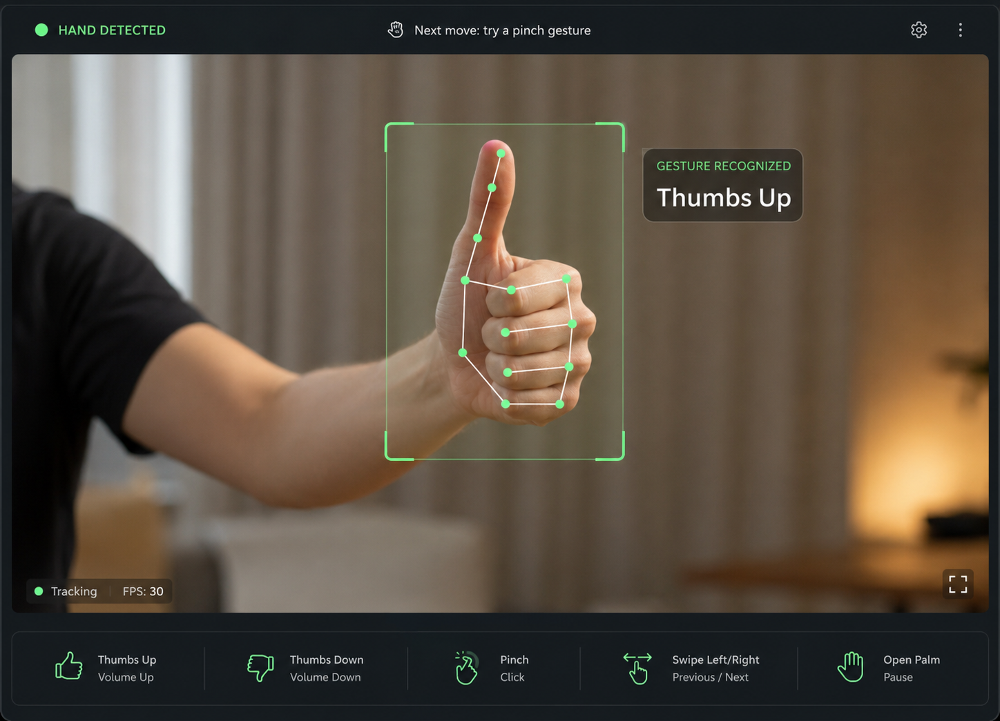
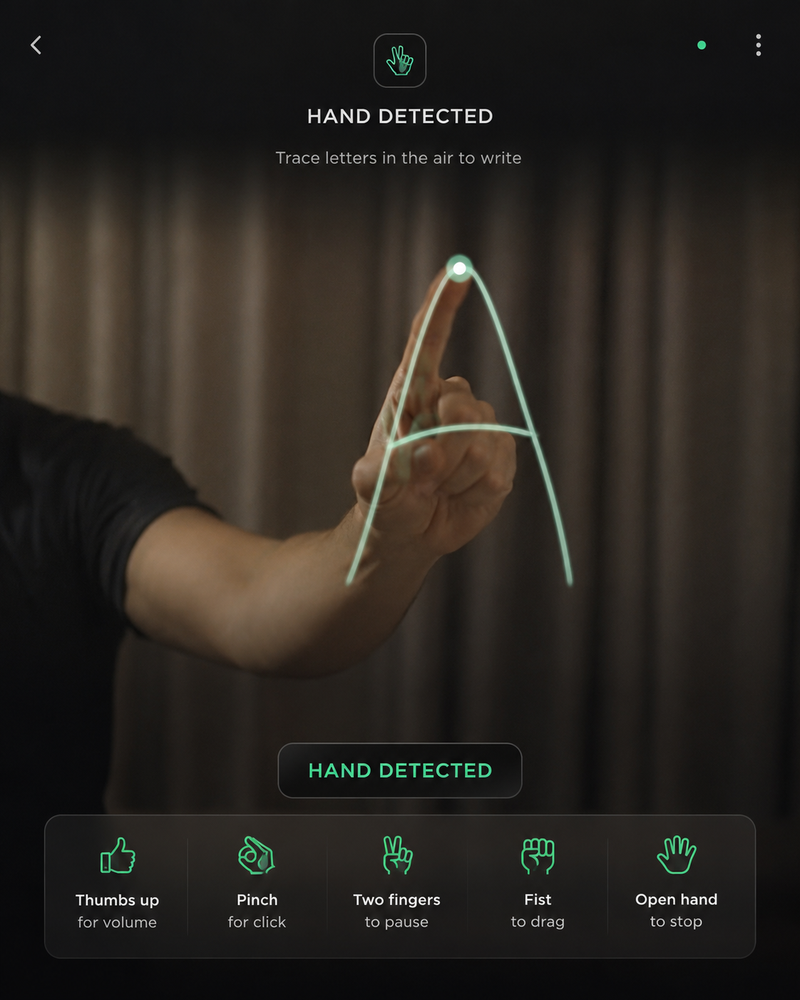
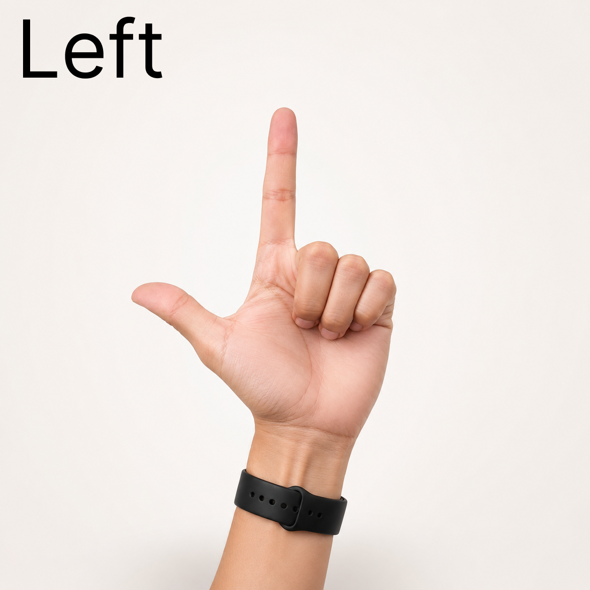
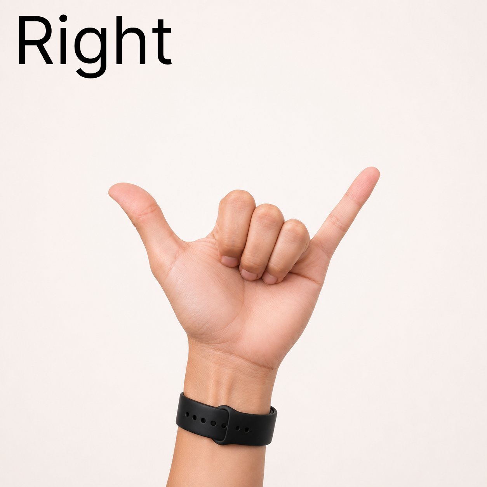
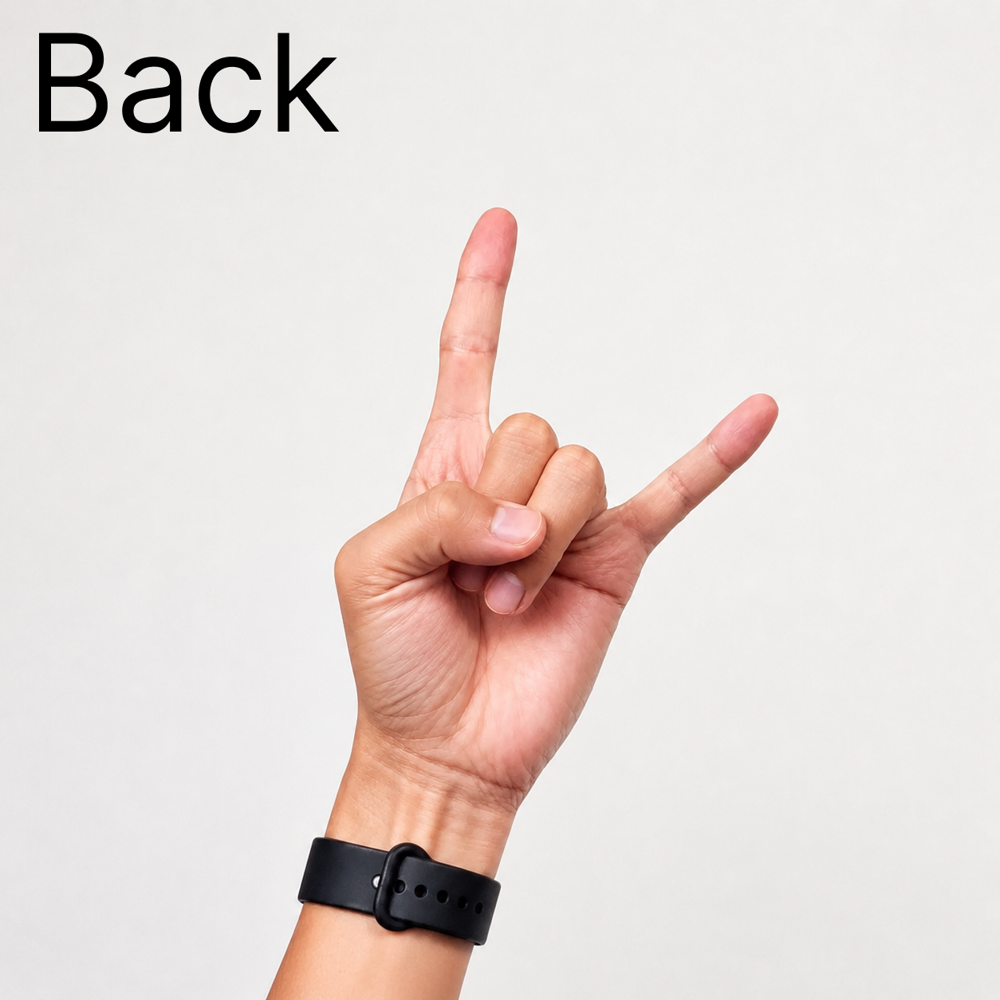
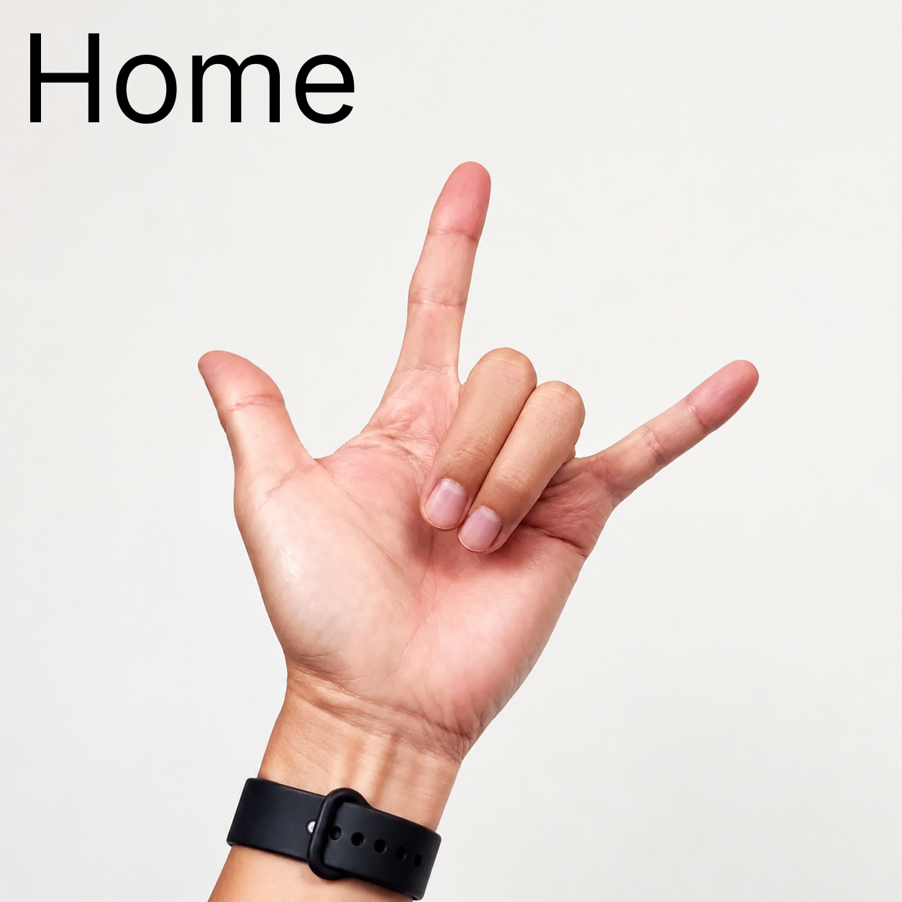

# Samsung Pocket Remote

A modern, fast, and highly customizable Samsung Smart TV remote built specifically for Samsung Smart TVs.

Samsung Pocket Remote focuses on speed, convenience, and personalization by combining powerful remote controls with advanced features such as touchpad navigation, keyboard and voice input, customizable shortcuts, YouTube integration, browser enhancements, widgets, and automation—all while running entirely on the local Wi-Fi network.

## Features

* 📺 Full local Wi-Fi control of compatible Samsung Smart TVs
* 🖐️ Real-time hand gesture control with live camera tracking and visual hand landmarks
* 🖱️ Touchpad with mouse cursor support across the TV interface and compatible apps
* ⌨️ Keyboard input with optional voice typing
* 🎤 Voice-assisted searching for YouTube and the TV browser
* ▶️ Two YouTube modes:

  * Remote Automation Mode
  * Optional YouTube API Mode
* 🌐 Faster browser navigation with quick URLs and saved websites
* ⭐ Favorite YouTube channels, websites, apps, and shortcuts
* ⚡ Custom macros and automation
* 📱 Home screen widgets
* 🔒 Lock screen controls
* 💾 Persistent settings and saved TV profiles
* 🎨 Clean, modern, expandable interface that keeps advanced features out of the way until needed

## Why?

Samsung SmartThings is an excellent general-purpose remote, but I wanted something designed around my own workflow.

Samsung Pocket Remote makes common actions faster by reducing the number of taps needed to perform everyday tasks while adding customization features that aren't available in traditional TV remote applications.

## Architecture

```text
Samsung Android Phone
        │
        │ Local Wi-Fi
        │
Samsung Smart TV
```

The application communicates directly with the TV over the local network.

No backend, cloud services, or external servers are required for the core experience.

Optional integrations, such as the YouTube API, can be enabled from Settings without affecting the primary functionality.

## Tech Stack

| Layer                | Technology                        |
| -------------------- | --------------------------------- |
| Mobile App           | Kotlin                            |
| UI                   | Jetpack Compose                   |
| Architecture         | MVVM                              |
| Networking           | OkHttp WebSocket                  |
| Asynchronous Tasks   | Kotlin Coroutines                 |
| Local Storage        | DataStore                         |
| Local Database       | Room (Macros & Advanced Features) |
| TV Communication     | Samsung Local WebSocket Protocol  |
| Optional Integration | YouTube Data API v3               |
| On-device Vision     | CameraX + MediaPipe                |
| Build System         | Gradle                            |
| IDE                  | Android Studio                    |

## Screenshots

| Remote 1 | Remote 2 | YouTube Shortcut |
| --- | --- | --- |
|  |  |  |

## Hand Gesture Control

| Hand Tracking 1 | Hand Tracking 2 |
| --- | --- |
|  |  |

<p>
  
  
  
  
</p>

The built-in gesture camera turns your hand into a touch-free Samsung TV remote. Recognition runs directly on the phone, draws the detected hand landmarks over the live camera feed, and shows the command being recognized before sending it to the TV.

* Point your index finger upward for **Up**.
* Point only your pinky upward for **Down**.
* Hold the illustrated L-shaped sign for **Left** or the illustrated shaka sign for **Right**.
* Hold your thumb upright for **Volume Up** or sideways in either direction for **Volume Down**.
* Pinch your thumb and index finger for **OK / click**.
* Pinch your thumb and pinky for a **double click**, with one second between clicks.
* Hold a **peace sign** for repeated **Up**.
* Hold up your index, middle, and ring fingers for repeated **Down**.
* Use the illustrated horns sign with the thumb folded for **Back**.
* Use the illustrated three-finger sign with the thumb extended for **Home**.
* Use an open-palm swipe for directional navigation.

Advanced mode adds an automatic, higher-speed Samsung Browser pointer, a natural closed-grip
volume knob, thumb-on-index rubbing for repeated left/right navigation, and a large transparent
QWERTY keyboard near the top of the camera that selects keys by holding the index finger over them.

## Project Goals

* Build a fast and responsive TV remote.
* Keep everything local and reliable.
* Prioritize usability over unnecessary complexity.
* Create a highly customizable experience.
* Support automation through macros and shortcuts.
* Deliver a polished application that feels native and professional.

---

Built as a personal project to explore Android development, Samsung Smart TV integration, networking, and modern mobile application architecture.
